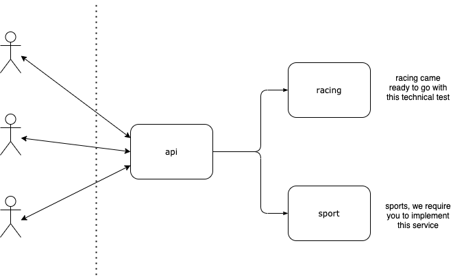

## Entain BE Technical Test

This test has been designed to demonstrate your ability and understanding of technologies commonly used at Entain. 

Please treat the services provided as if they would live in a real-world environment.

### Directory Structure

- `api`: A basic REST gateway, forwarding requests onto service(s).
- `racing`: A very bare-bones racing service.
- [`sports`](sports/README.md): A service for sporting events.

```
entain/
├─ api/
│  ├─ proto/
│  ├─ main.go
├─ racing/
│  ├─ db/
│  ├─ proto/
│  ├─ service/
│  ├─ main.go
├─ sports/
│  ├─ db/
│  ├─ proto/
│  ├─ service/
│  ├─ main.go/
│  ├─ README.md
├─ README.md
```

### Getting Started

1. Install Go (latest).

```bash
brew install go
```

... or [see here](https://golang.org/doc/install).

2. Install `protoc`

```
brew install protobuf
```

... or [see here](https://grpc.io/docs/protoc-installation/).

2. In a terminal window, start our racing service...

```bash
cd ./racing

go build && ./racing
➜ INFO[0000] gRPC server listening on: localhost:9000
```

3. In another terminal window, start our api service...

```bash
cd ./api

go build && ./api
➜ INFO[0000] API server listening on: localhost:8000
```

4. Make a request for races... 

```bash
curl -X "POST" "http://localhost:8000/v1/list-races" \
     -H 'Content-Type: application/json' \
     -d $'{
  "filter": {}
}'
```

### Changes/Updates Required

- We'd like to see you push this repository up to **GitHub/Gitlab/Bitbucket** and lodge a **Pull/Merge Request for each** of the below tasks.
- This means, we'd end up with **5x PR's** in total. **Each PR should target the previous**, so they build on one-another.
- Alternatively you can merge each PR/MR after each other into master.
- This will allow us to review your changes as well as we possibly can.
- As your code will be reviewed by multiple people, it's preferred if the repository is **publicly accessible**. 
- If making the repository public is not possible; you may choose to create a separate account or ask us for multiple email addresses which you can then add as viewers. 

... and now to the test! Please complete the following tasks.

1. Add another filter to the existing RPC, so we can call `ListRaces` asking for races that are visible only.
   > We'd like to continue to be able to fetch all races regardless of their visibility, so try naming your filter as logically as possible. https://cloud.google.com/apis/design/standard_methods#list
2. We'd like to see the races returned, ordered by their `advertised_start_time`
   > Bonus points if you allow the consumer to specify an ORDER/SORT-BY they might be after. 
3. Our races require a new `status` field that is derived based on their `advertised_start_time`'s. The status is simply, `OPEN` or `CLOSED`. All races that have an `advertised_start_time` in the past should reflect `CLOSED`. 
   > There's a number of ways this could be implemented. Just have a go!
4. Introduce a new RPC, that allows us to fetch a single race by its ID.
   > This link here might help you on your way: https://cloud.google.com/apis/design/standard_methods#get
5. Create a `sports` service that for sake of simplicity, implements a similar API to racing. This sports API can be called `ListEvents`. We'll leave it up to you to determine what you might think a sports event is made up off, but it should at minimum have an `id`, a `name` and an `advertised_start_time`.

> Note: this should be a separate service, not bolted onto the existing racing service. At an extremely high-level, the diagram below attempts to provide a visual representation showing the separation of services needed and flow of requests.
> 
> 


**Don't forget:**

> Document and comment! Please make sure your work is appropriately documented/commented, so fellow developers know whats going on.

**Note:**

To aid in proto generation following any changes, you can run `go generate ./...` from `api` and `racing` directories.

Before you do so, please ensure you have the following installed. You can simply run the following command below in each of `api` and `racing` directories.

```
go get github.com/grpc-ecosystem/grpc-gateway/v2/protoc-gen-grpc-gateway github.com/grpc-ecosystem/grpc-gateway/v2/protoc-gen-openapiv2 google.golang.org/genproto/googleapis/api google.golang.org/grpc/cmd/protoc-gen-go-grpc google.golang.org/protobuf/cmd/protoc-gen-go
```

### Good Reading

- [Protocol Buffers](https://developers.google.com/protocol-buffers)
- [Google API Design](https://cloud.google.com/apis/design)
- [Go Modules](https://golang.org/ref/mod)
- [Ubers Go Style Guide](https://github.com/uber-go/guide/blob/2910ce2e11d0e0cba2cece2c60ae45e3a984ffe5/style.md)
